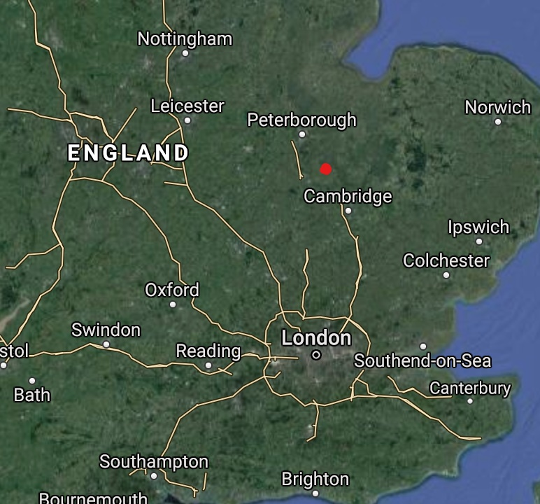

```{r setup, include=FALSE}
knitr::opts_chunk$set(echo = TRUE)
```

```{r 1, echo=FALSE}
install.packages('plyr')
install.packages('dplyr')
```


# Introduction

The invertebrate order Odonata is comprised of at least 5680 freshwater insects and are commonly referred to as damselflies and dragonflies. Due to the larvae’s need for freshwater, they can be used as gauges for local environmental quality and health (Kalkman *et al.* 2008). Destruction of habitation and changes in water quality have led to decreases in species distributions, although extinction is not an immediate worry for most, as they often have broad distributions (Kalkman *et al.* 2008).  
 
The order is of particular interest for their reproductive behaviors, with males of the species utilizing the aedeagus not only for sperm transfer from a secondary sexual organ, but also for the removal of sperm already in a female’s storage organs (Waage, 1979). Additionally, because many species are quite conspicuous in their coloration, they are possible for identification by non-experts. This makes them an interesting and entertaining aspect of outdoor recreation and wildlife hobbyists. 

Although the highest biodiversity of Odonates resides in the Neotropical and Oriental regions (Kalkman *et al.* 2008), Odonates extend into temperate zones, albeit with less diversification. This project is concerned with East Anglia, a region in eastern England. This area was formerly swampy, or fenland, until it was drained for agricultural use over the last few centuries (DeFries *et al.* 2004). Habitat changes such as fragmentation and/or loss often lead to decreases in biodiversity (DeFries *et al.* 2004), as stated above for Odonates. Conservation and preservation attempts over the last century have moved to protect remaining areas and return others back to their original (or similar) functions. There has been work since the late 1950s in East Anglia to preserve ancient fens with the possibility of reconnecting the remaining fragments into a “Great Fen” (“Great”, n.d.) in the relevant area. 
 
The recent movement to assess the environmental-agricultural trade-offs of reclaimed lands in England (and elsewhere) requires a careful balance between the environmental benefits of conservation and the financial difficulties for farmers and locals (Morris et al. 2000). There is the possibility of determining areas of lower agricultural production that can be returned to their former state without detrimental effects to local famers (Morris *et al.* 2000; “Great”, n.d.). 


# Objectives

The goals of this study can be separated into two main purposes: description of changing (or not) species abundance over more than two decades and a focus on transparency and reproducibility in the workflow.

* Does *Odonata* abundance significantly change over the course of the study?
* Do species appear to follow different patterns of abundance changes?
* Do certain species seem to suffer upon the introduction of others?
  + How does this match up with current citizen science?
  
The first three main objectives will be answered from the dataset from the original study (Morris, 1991). The final sub-bullet is not meant to be answered with true rigor and was not an original objective proposed, but is an interesting way to include citizen science. It is not expected to be comprehensive or a full picture of current Odonate diversity at the study site.


## Data Source 

The data for this descriptive study is available through BioTIME (biotime.st-andrews.ac.uk/downloadArea.php), a database devoted to biodiversity. The database is dynamic and does not have an API, making reproducibility via the database a step more difficult. The dataset itself is constant, but its online source changing. The dataset was not originally representative of the first study’s findings, and required significant manipulation. The methods and resulting implications for reproducibility will be discussed in more detail in later sections.  

 
```{r, echo=FALSE, fig.cap = 'Sample of the unmanipulated data set.'}
DataSingleStudy <- read.csv("~/GitHub/rrirfinalproject/DataSingleStudy")
head(DataSingleStudy)
```


## Study Site 

The work was carried out at Woodwalton Fen (Long, Lat) in Huntingdon, England, from 1959 to 1988. The area was primarily an ancient fen, or a wetland, until most of the area was drained in the 1800s for agricultural use. In the mid-1900s the study area was restructured as a flood reservoir, recreating the wetland aspect. The original study followed Odonata species to characterize territorial changes and patterns throughout the project (Citation).  




## Approach 

The original study characterized the return and territoriality of dragonflies and damselflies at the site. In this study, I seek to better characterize the significance of species-specific changes over the study period in order to tease apart any possible changes in overall abundance. The main questions were outlined earlier in the objectives.

# Methods

The data used is publicly available for download and use from BioTIME (Dornela *et al.* 2018) or from the Github repository (https://github.com/mvcarneal/rrirfinalproject) hosting the analytical pipeline for this project. The data was manipulated (with an original retained) in R Version 4.0.2 with the additional packages ‘plyr’ and ‘dplyr’. The manipulated dataset is also available on the aforementioned Github repository, along with the code used in the analysis folder. As the dataset was previously compiled and published, the methods for this project will concern the approach taken and code utilized. 


Base, plyr and dplyr were utilized in an attempt to keep the number of packages small and the threshold for reproducibility lower, and Docker used to create a container for reproducibility. The latter two aided in the manipulation of the dataset.

# Results

```{r 2, echo=FALSE}
library('plyr')
library('dplyr')

DataSingleStudy <- read.csv("~/GitHub/rrirfinalproject/DataSingleStudy")
rawDragonfly <- `DataSingleStudy`

cPuella <- dplyr::filter(rawDragonfly, GENUS_SPECIES == 'Coenagrion puella')
iElegans <- dplyr::filter(rawDragonfly, GENUS_SPECIES == 'Ischnura elegans')
lSponsa <- dplyr::filter(rawDragonfly, GENUS_SPECIES == 'Lestes sponsa')
lQuadrimaculata <- dplyr::filter(rawDragonfly, GENUS_SPECIES == 'Libellula quadrimaculata')
sStriolatum <- dplyr::filter(rawDragonfly, GENUS_SPECIES == 'Sympetrum striolatum')

getAbundanceYear <- function(dat, x = 'ABUNDANCE', y = 'YEAR'){
                    tmp <- subset(dat, select = c(x, y))
                    return(tmp)
}

iElegansAY <- getAbundanceYear(iElegans)
cPuellaAY <- getAbundanceYear(cPuella)
lSponsaAY <- getAbundanceYear(lSponsa)
lQuadrimaculataAY <- getAbundanceYear(lQuadrimaculata)
sStriolatumAY <- getAbundanceYear(sStriolatum)

iElegansSAY <- dplyr::rename(iElegansAY, iElegansAbundance = ABUNDANCE)
cPuellaSAY <- dplyr::rename(cPuellaAY, cPuellaAbundance = ABUNDANCE)
lSponsaSAY <- dplyr::rename(lSponsaAY, lSponsaAbundance = ABUNDANCE)
lQuadrimaculataSAY <- dplyr::rename(lQuadrimaculataAY, lQuadrimaculataAbundance = ABUNDANCE)
sStriolatumSAY <- dplyr::rename(sStriolatumAY, sStriolatumAbundance = ABUNDANCE)

row1959 <- c(0, 1959)
row1960 <- c(0, 1960)
row1961 <- c(0, 1961)
row1962 <- c(0, 1962)
row1963 <- c(0, 1963)

row1972 <- c(0, 1972)
row1974 <- c(0, 1974)

cPuellaCompAY <- rbind(row1959, row1960, row1961, row1962, cPuellaSAY)
iElegansCompAY <- rbind(row1959, row1960, row1961, iElegansSAY)
lSponsaCompAY <- rbind(row1959, row1960, row1961, row1962, row1963, lSponsaSAY)
# lQuadrimaculata will be dealt with differently because it is missing rows within the dataframe
sStriolatumCompAY <- rbind(row1959, row1960, row1961, sStriolatumSAY)

prelibellulaCompAY <- rbind(row1960, row1972, row1974, lQuadrimaculataSAY)
# this will add the rows I want, but now in chronological order
lQuadrimaculataCompAY <- dplyr::arrange(prelibellulaCompAY, YEAR)

# there are species missing from this dataset, they need to be added separately, I will source (and cite) the abundance data
# also need a vector corresponding to the years

YEAR <- c(1959:1988)

bPratenseAbundance <- c(0,0,0,0,0,0,0,0,0,1,0,0,2,0,0,0,0,0,0,0,0,0,0,0,0,0,0,0,0,0)
pNymphulaAbundance <- c(0,0,3,20,18,5,1,0,0,0,0,0,0,0,0,0,0,0,0,0,0,0,0,0,0,0,0,0,0,0)
aCyaneaAbundance <- c(0,0,0,0,1,2,3,1,1,2,3,1,5,1,2,0,0,0,1,1,1,0,2,1,1,3,1,2,2,2)
sSanguineumAbundance <- c(0,0,0,0,0,1,0,0,1,0,2,0,1,0,0,1,0,1,4, 11, 3, 0, 1, 9, 6, 10, 4, 9, 3, 4)
aGrandisAbundance <- c(0,0,0,0,0,0,0,4,0,1,1,0,2,0,2,0,0,0,1,1,0,1,2,1,0,1,1,4,0,1)

bPratenseCompAY <- data.frame(bPratenseAbundance, YEAR)
pNymphulaCompAY <- data.frame(pNymphulaAbundance, YEAR)
aCyaneaCompAY <- data.frame(aCyaneaAbundance, YEAR)
sSanguineumCompAY <- data.frame(sSanguineumAbundance, YEAR)
aGrandisCompAY <- data.frame(aGrandisAbundance, YEAR)

# I am going to join these 10 dataframes by the common column year
# I want year on the far left so I am going to reorder the first dataframe that will determine the order of my join function

bPratenseCompAY2 <- subset(bPratenseCompAY, select = c(2,1))

join1 <- dplyr::left_join(bPratenseCompAY2, pNymphulaCompAY, by= NULL)
join2 <- dplyr::left_join(join1, aCyaneaCompAY, by = NULL)
join3 <- dplyr::left_join(join2, sSanguineumCompAY, by = NULL)
join4 <- dplyr::left_join(join3, aGrandisCompAY, by = NULL)
join5 <- dplyr::left_join(join4, cPuellaCompAY, by = NULL)
join6 <- dplyr::left_join(join5, iElegansCompAY, by = NULL)
join7 <- dplyr::left_join(join6, lSponsaCompAY, by = NULL)
join8 <- dplyr::left_join(join7, lQuadrimaculataCompAY, by = NULL)
fullAbundanceDF <- dplyr::left_join(join8, sStriolatumCompAY, by = NULL)

# I want a total for each year

abundanceSums <- data.frame(rowSums(fullAbundanceDF[,c(2,3,4,5,6,7,8,9,10,11)]))
abundance_year <- cbind(abundanceSums, new_col = YEAR)
abundanceYearSums <- subset(abundance_year, select = c(2,1))

abunYearSums_1 <- dplyr::rename(abundanceYearSums, year = new_col)
abunYearsSums <- dplyr::rename(abunYearSums_1, total_abundance = rowSums.fullAbundanceDF...c.2..3..4..5..6..7..8..9..10..11...)
```


The damselflies and dragonflies in this study are listed in Table 1 for reference. The figure below (Fig. 2), is a linear regression model of the maximum abundance of males in a single day from 1959  to 1988. The abundance corresponds to the sum of the ten species in Table 1 and the p-value for the model was 0.000162. Figure 3 is the ten LM of the corresponding species, with p-values shown in Table 2. Figure 4 is a model of the total number of species per year over the study period. It does not have a fitted line or a p-value for reasons that will be discussed later. 


```{r 3, echo=FALSE,}

# weird character in genus column name, need to rename it, dplyr function

odonata_Woodwalton <- dplyr::rename(odonata_names, GENUS = ï..GENUS)

knitr::kable(odonata_Woodwalton, caption = 'Table 1. Species and common names of ten Odonates found at Woodwalton Fen between 1959 and 1988.')

```

```{r, echo=FALSE, fig.align=center, fig.cap='**Figure 2** Linear model of abundance of all ten species from 1959 to 1988. p-value = 0.000162 }
par(mfrow=c(1,1))
plot(abunYearsSums$year, abunYearsSums$total_abundance, xlab = "Year", ylab = "Abundance")
abline(lm(abunYearsSums$total_abundance ~ abunYearsSums$year), col="red")
```


```{r 4, echo=TRUE}
fitTotal <- lm(abunYearsSums$total_abundance ~ abunYearsSums$year)

summary(fitTotal)

pValueTotal <- 0.000162

```


```{r, echo=FALSE, fig.cap=paste("Figure 3. Abundances broken down by species with line of best fit.") }
par(mfrow=c(2,5))
plot(bPratenseCompAY$YEAR, bPratenseCompAY$bPratenseAbundance, main = "Brachytron pratense", xlab = "Year", ylab = "Abundance")
abline(lm (bPratenseCompAY$bPratenseAbundance ~ bPratenseCompAY$YEAR), col="red")

plot(pNymphulaCompAY$YEAR, pNymphulaCompAY$pNymphulaAbundance, main = "Pyrrhosa nymphula", xlab = "Year", ylab = "Abundance")
abline(lm (pNymphulaCompAY$pNymphulaAbundance ~ pNymphulaCompAY$YEAR), col="red")

plot(aCyaneaCompAY$YEAR, aCyaneaCompAY$aCyaneaAbundance, main = "Aeshna cyanea", xlab = "Year", ylab = "Abundance")
abline(lm(aCyaneaCompAY$aCyaneaAbundance ~ aCyaneaCompAY$YEAR), col="red")

plot(sSanguineumCompAY$YEAR, sSanguineumCompAY$sSanguineumAbundance, main = "Sympetrum sanguineum", xlab = "Year", ylab = "Abundance")
abline(lm(sSanguineumCompAY$sSanguineumAbundance ~ sSanguineumCompAY$YEAR), col="red")

plot(aGrandisCompAY$YEAR, aGrandisCompAY$aGrandisAbundance, main = "Aeshna grandis", xlab = "Year", ylab = "Abundance")
abline(lm(aGrandisCompAY$aGrandisAbundance ~ aGrandisCompAY$YEAR), col="red")

plot(cPuellaCompAY$YEAR, cPuellaCompAY$cPuellaAbundance, main = "Coenagrion puella", xlab = "Year", ylab = "Abundance")
abline(lm(cPuellaCompAY$cPuellaAbundance ~ cPuellaCompAY$YEAR), col="red")

plot(iElegansCompAY$YEAR, iElegansCompAY$iElegansAbundance, main = "Ischnura elegans", xlab = "Year", ylab = "Abundance")
abline(lm(iElegansCompAY$iElegansAbundance ~ iElegansCompAY$YEAR), col="red")

plot(lSponsaCompAY$YEAR, lSponsaCompAY$lSponsaAbundance, main = "Lestes sponsa", xlab = "Year", ylab = "Abundance")
abline(lm(lSponsaCompAY$lSponsaAbundance ~ lSponsaCompAY$YEAR), col="red")

plot(lQuadrimaculataCompAY$YEAR, lQuadrimaculataCompAY$lQuadrimaculataAbundance, main = "Libellula quadrimaculata", xlab = "Year", ylab = "Abundance")
abline(lm(lQuadrimaculataCompAY$lQuadrimaculataAbundance ~ lQuadrimaculataCompAY$YEAR), col="red")

plot(sStriolatumCompAY$YEAR, sStriolatumCompAY$sStriolatumAbundance, main = "Sympetrum striolatum", xlab = "Year", ylab = "Abundance")
abline(lm(sStriolatumCompAY$sStriolatumAbundance ~ sStriolatumCompAY$YEAR), col="red")


```


```{r 5, echo=FALSE}
library('plyr')
library('dplyr')

names_p_values <- read.csv("~/GitHub/rrirfinalproject/analysis/names_p_values.csv")

# strange character in column name for species

corrected_names_p_values <- dplyr::rename(names_p_values, Species = ï..SPECIES)


knitr::kable(corrected_names_p_values, caption = 'Table 2. p-values from the LM for each species and all species combined shown in Figure 2. Significance shown with asterisks.')

```


```{r 6, echo=FALSE, fig.cap="Figure 4. Number of species in each year of the study period. Note that this is not a comprehensive list of all Odonates at the site, this will be addressed in the discussion."}
# I want to know how many species there are in a given year, subsetting using the which function and finding the length of that subset
# I will save each as with a corresponding year identifier because I have not yet decided what format I want them all in (dataframe, table, etc.)

ASpecies <- length(which(fullAbundanceDF[1,2:11] != 0))
BSpecies <- length(which(fullAbundanceDF[2,2:11] != 0))
CSpecies <- length(which(fullAbundanceDF[3,2:11] != 0))
DSpecies <- length(which(fullAbundanceDF[4,2:11] != 0))
ESpecies <- length(which(fullAbundanceDF[5,2:11] != 0))
FSpecies <- length(which(fullAbundanceDF[6,2:11] != 0))
GSpecies <- length(which(fullAbundanceDF[7,2:11] != 0))
HSpecies <- length(which(fullAbundanceDF[8,2:11] != 0))
ISpecies <- length(which(fullAbundanceDF[9,2:11] != 0))
JSpecies <- length(which(fullAbundanceDF[10,2:11] != 0))
KSpecies <- length(which(fullAbundanceDF[11,2:11] != 0))
LSpecies <- length(which(fullAbundanceDF[12,2:11] != 0))
MSpecies <- length(which(fullAbundanceDF[13,2:11] != 0))
NSpecies <- length(which(fullAbundanceDF[14,2:11] != 0))
OSpecies <- length(which(fullAbundanceDF[15,2:11] != 0))
PSpecies <- length(which(fullAbundanceDF[16,2:11] != 0))
QSpecies <- length(which(fullAbundanceDF[17,2:11] != 0))
RSpecies <- length(which(fullAbundanceDF[18,2:11] != 0))
SSpecies <- length(which(fullAbundanceDF[19,2:11] != 0))
TSpecies <- length(which(fullAbundanceDF[20,2:11] != 0))
USpecies <- length(which(fullAbundanceDF[21,2:11] != 0))
VSpecies <- length(which(fullAbundanceDF[22,2:11] != 0))
XSpecies <- length(which(fullAbundanceDF[23,2:11] != 0))
YSpecies <- length(which(fullAbundanceDF[24,2:11] != 0))
ZSpecies <- length(which(fullAbundanceDF[25,2:11] != 0))
AASpecies <- length(which(fullAbundanceDF[26,2:11] != 0))
ABSpecies <- length(which(fullAbundanceDF[27,2:11] != 0))
ACSpecies <- length(which(fullAbundanceDF[28,2:11] != 0))
ADSpecies <- length(which(fullAbundanceDF[29,2:11] != 0))
AESpecies <- length(which(fullAbundanceDF[30,2:11] != 0))

# number of species in chronological order
# I'll reuse the years vector I created earlier to make a data.frame

speciesChrono <- c(ASpecies, BSpecies, CSpecies, DSpecies, ESpecies, FSpecies, GSpecies, HSpecies, ISpecies, JSpecies, KSpecies, LSpecies, MSpecies, NSpecies, OSpecies, PSpecies, QSpecies, RSpecies, SSpecies, TSpecies, USpecies, VSpecies, XSpecies, YSpecies, ZSpecies, AASpecies, ABSpecies, ACSpecies, ADSpecies, AESpecies)

speciesByYear <- data.frame(YEAR, speciesChrono)

# look at it graphically

par(mfrow=c(1,1))
plot(speciesByYear$YEAR, speciesByYear$speciesChrono, xlab = "Year", ylab = "Species Number")

```


# Discussion

Taken together, the abundance of all ten species had a clear upward trend in abundance from 1959 to 1988 (Fig. 2). When modeled, the change in abundance was significant (Table 2), indicating the pond construction at Woodwalton Fen increased Odonate abundance. In order to see if certain species were driving these abundance changes, each species was analyzed with a simple linear regression model (Fig. 3) and fitted with a line of best fit. Of the ten species, five had significant changes in abundance over the study period (Table 2), indicating not all species were responsible for the overall change in abundance. Three species had significant increases in abundance, *C. puella*, *S. Sanguineum*, and *L. sponsa*. Interestingly, two species had significant downtrends, *L. quadrimaculata* started at over 150 individuals and dropped to less than a third of that for the last decade of the study period. *P. nymphula* was also indicated as a significant abundance decrease in the model, but with a smaller peak abundance (~20), the results should be taken with a grain of salt. Of the ten species, six of them had peak abundances of less than 25, meaning errors in field observations could easily sway the findings. This should be considered in the species with a significant decrease (*P. nymphula*) and possibly *B. pratense*. The peak abundance for this species was two, with the species not reported after the mid-seventies. While not significant for the abundance patterns objectives, it will be interesting when compared later against current citizen science. 

Figure 4 shows the number of species per year, corresponding to the final objective concerning species diversity and richness. The model shows a period of early, rapid colonization and then a maintenance of eight of the ten species. However, upon consultation with the original study (Moore, 1991), it became apparent that the ten species were not the only ones seen at Woodwalton Fen over the study period. As such, Figure 4 cannot be considered a comprehensive description of Odonate species diversity at the site. Further analysis considering evenness and richness were halted so as to not mischaracterize the site. The original study, however, did mention a similar pattern of rapid colonization early on, potentially holding with this study’s findings of a subset of the species.

Due to the time in between the original study and this one (~30 years), current citizen science from iNaturalist (https://www.inaturalist.org/, via GBIf, https://www.gbif.org/) was incorporated merely out of curiosity of the researcher. This data is not meant as a conclusive determination of current Odonate diversity at Woodwalton Fen (52.4433623, -0.2081061), but an incorporation of what people have found at the site in 2019 and 2020. Four species were listed on the iNaturalist species list for Woodwalton Fen (https://www.inaturalist.org/places/woodwalton-fen). These species were *C. puella* (British, 2020), *S. sanguineum* (Ueda, 2020), *L. quadrimaculata* (Ueda, 2020), and *B. pratense* (Ueda, 2020).

This project was inherently limited by the structure and lack of completeness of the data set obtained. Perhaps the most important conclusion of this project is the forethought required in how data is collected and databased for future use. Morris, the original researcher, collected this information in a time when these considerations did not need to be taken, as open source data sets were certainly not on the average researcher's mind. While this study is limited in its analytic ability, the author does not intend to masquerade the results as such. Much of the ecological information needed in order to determine the most important factors in *Odonata* diversity (vegetation, pond area, scrub management as possibilities) is not available. Therefore, the findings of the original study cannot be expanded upon in an ecological sense. It also showcases the difficulty in finding representative and complete data sets, with the admission that this data set might not have been the best choice, at least not on its own.


# Reproducibility

The unmanipulated dataset and analysis are hosted on a Github repository (linked in the Methods section), along with the manipulated dataset and corresponding code, figures, license information and a Docker file. The dataset was not called for using an API, making it necessary to download externally and import into R. The original directions are documented in the analysis (on Github) and the unmanipulated dataset can also be downloaded from the Github repository. As mentioned earlier, the original dataset had some issues that had to be resolved prior to analysis. Abundances of “zero” were not entered into the dataset, leaving that year out of the dataset entirely. Several species were also left out, but using the orignal study were returned to the data set. An image from the original study is in the analysis folder on the Github repository for easy reference (Morris, 1991). Once these were returned the dataset, further manipulation and analysis was possible. The analysis, an R markdown file, details how to download the dataset and shows the code for manipulation in order to minimize any reproducibility issues and show transparency.


# Conclusions

The construction of the area as a flood reservoir was successful in increasing Odonate species at the fen and in increasing the overall abundance of Odonates in the area.  Additionally, while not certain, there is possibility that the  trend is that of a rapid and early colonization by Odonates. If true, this could be good news for places around the world with degraded wetlands. If fauna and flora can recolonize quickly after changes are made to return land to more closely resemble its original form, we have hope for the reclamation of former cropland. Drainage of wetlands or clearance of forests for agricultural use is widespread both temporally and geographically, with about 1/3 of global land under agricultural use (DeFries et al. 2004). With many nations and localities considering the environmental trade-offs of land-use for agriculture, success stories like the Odonates in Woodwalton Fen are beneficial. 

These fens (as a type of wetland) provide multiple ecosystem services, biodiversity, water quality management, flood management, and carbon storage (Zedler & Kercher, 2005). They are also excellent resources for wildlife hobbyists and local residents as nature reserves. Local residents may be particularly important in the preservation and conservation of fens, as they are the humans most immediately affected by ecosystem changes. 


# References

British Dragonfly Society Recording Scheme (2020). Dragonfly records from the British Dragonfly Society Recording Scheme. Occurrence dataset https://doi.org/10.15468/cuyjyi accessed via GBIF.org on 2020-12-03.

Dornela M, Antao LH, Moyes F, Bates A. E., *et al.* BioTIME: A database of biodiversity time series for the Anthropocene. *Global Ecol Biogeogr.* 2018; 27:760-786. https://doi.org/10.1111/geb.12729

Kalkman, V. J., Clausnitzer V., Dijkstra K. B., Orr A. G., Paulson D. R., van Tol J. (2008) Global diversity of dragonflies (Odonata) in freshwater. *Hydrobiologia*, **595**, 351-363. 

Moore, N. W. (1991) The development of dragonfly communities and the consequences of territorial behavior: a 27 year study on small ponds at Woodwalton Fen, Cambridgeshire, United Kingdom. *Odonatologica*, **20**(2), 203-231.

Morris, J., Gowing D. J. G., Mills, J., Dunderdale, J. A. L. (2000) Reconciling agricultural economic and environmental objectives: the case of recreating wetlands in the Fenland area of Eastern England. *Agriculture, Ecosystems and Environment*, **79**, 245-257.

Ueda K (2020). iNaturalist Research-grade Observations. iNaturalist.org. Occurrence dataset https://doi.org/10.15468/ab3s5x accessed via GBIF.org on 2020-12-03

Waage, J. K. (1979) Dual function of the damselfly penis: Sperm removal and transfer. *Science*, **203**:4383, 916-918.

The Wildlife Trusts (n.d.) About the Great Fen. https://www.greatfen.org.uk/about-great-fen

Zedler, J. B., Kercher, S. (2005) Wetland Resources: Status, trends, ecosystem services, and restorability. *Annu. Rev. Environ. Resour.*, **30**, 39-74.

